# Ссылки
- [Черновик статьи](https://gist.github.com/anton-sergeenkov/a945fa359da2c19a9154c2153ead0197)
- [Статья на Habr](https://habr.com/ru/post/580894/)

# Разработка документации на VuePress

1. [Описание инструмента](#description)
2. [Предварительная подготовка](#prepare)
    - [Установка Node.js и NPM](#prepare-node)
    - [Проверка корректности установки](#prepare-check)
3. [Установка NPX-пакета с готовой архитектурой](#npx)
    - [Установка create-vuepress-site](#npx-create-vuepress-site)
    - [Запуск проекта](#npx-run)
4. [Разработка приложения на VuePress с нуля](#develop)
    - [Инициализация проекта](#develop-init)
    - [Установка VuePress](#develop-install)
    - [Добавление скриптов](#develop-scripts)
    - [Разработка архитектуры приложения](#develop-structure)
    - [Markdown-файлы](#develop-markdown)
    - [Файл config.js](#develop-config)
    - [Запуск приложения](#develop-run)
    - [Добавление изображений](#develop-img)
    - [Добавление favicon и meta-данных](#develop-favicon)
    - [Изменение цветовой схемы](#develop-color-theme)
    - [Подключение поиска](#develop-search)
    - [Использование Vue-компонентов](#develop-vue)
    - [Сборка проекта](#develop-build)
    - [Задание корневого URL](#develop-base-url)
    - [Деплой на GitHub](#develop-github)
    - [Деплой на GitHub Pages](#develop-github-pages)
5. [Ссылки](#links)

---

## <a name="description"></a> Описание инструмента

[VuePress](https://vuepress.vuejs.org/guide/#how-it-works) представляет собой минималистичный генератор статичных сайтов, оптимизированный для написания технической документации.

Изначальной целью VuePress, была поддержка фреймворка Vue.js и сопутствующей инфраструктуры. Для примера, можно посмотреть любую документацию по Vue: [Vue.js](https://vuejs.org/), [Vue Router](https://router.vuejs.org/), [Vuex](https://vuex.vuejs.org/), где применяется единый стиль, заложенный в основе VuePress.

В ходе статьи мы разберем архитектуру VuePress, разработаем базовое приложение и выложим на [GitHub Pages](https://pages.github.com/).

---

## <a name="prepare"></a> Предварительная подготовка

### <a name="prepare-node"></a> 1. Установка Node.js и NPM

Устанавливаем "Current" версию Node.js с [официального сайта](https://nodejs.org/en/). При установке на Windows, NPM входит в состав Node.js по умолчанию. Для Linux необходимо устанавливать NPM отдельно.

### <a name="prepare-check"></a> 2. Проверка корректности установки

После установки, откроем терминал и проверим версии Node.js и NPM. Если в ответ получим номер версии - значит установлено корректно.
```bash
node -v # проверяем версию Node.js
npm -v  # проверяем версию NPM
```

---

## <a name="npx"></a> Установка NPX-пакета с готовой архитектурой

### <a name="npx-create-vuepress-site"></a> 1. Установка create-vuepress-site

Создаем директорию для проекта и открываем в редакторе. Вызываем терминал из текущей директории и устанавливаем пакеты:

```bash
npx create-vuepress-site
```

После этого VuePress попросит указать данные для настройки файла `"package.json"`: название проекта, описание и прочее. Файл `"package.json"` потребуется для установки npm-пакетов и запуска скриптов.

В итоге, будет создана базовая структура:

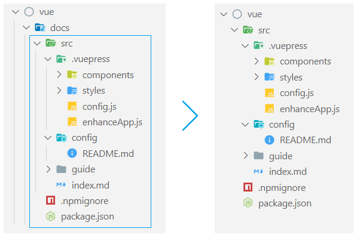

Корневая директория `"docs"` подразумевает использование VuePress внутри рабочего проекта. Мы будем разрабатывать только документацию, поэтому уберем лишний уровень вложенности: удалим директорию `"docs"`, а всё содержимое поместим в корень проекта.

### <a name="npx-run"></a> 2. Запуск проекта

Настало время запустить проект. Для этого перейдём в файл `"package.json"` и посмотрим на уже подготовленные скрипты.

```json
"scripts": {
    "dev": "vuepress dev src",
    "build": "vuepress build src"
}
```

- Скрипт `"dev"` запустит приложение на локальном сервере.
- Скрипт `"build"` соберет приложение для production.

Запуск скриптов осуществляется через терминал:
```bash
npm run dev
npm run build
```

При запуске скрипта `"dev"`, в терминале будет сообщение об успешной сборке и адрес локального сервера: [http://localhost:8080/](http://localhost:8080/).
```bash
success [11:09:20] Build 257d7d finished in 4856 ms!
> VuePress dev server listening at http://localhost:8080/
```

Главная страница стартового приложения состоит из поиска по разделам, страницы "Guide", страницы "Config" и контента.

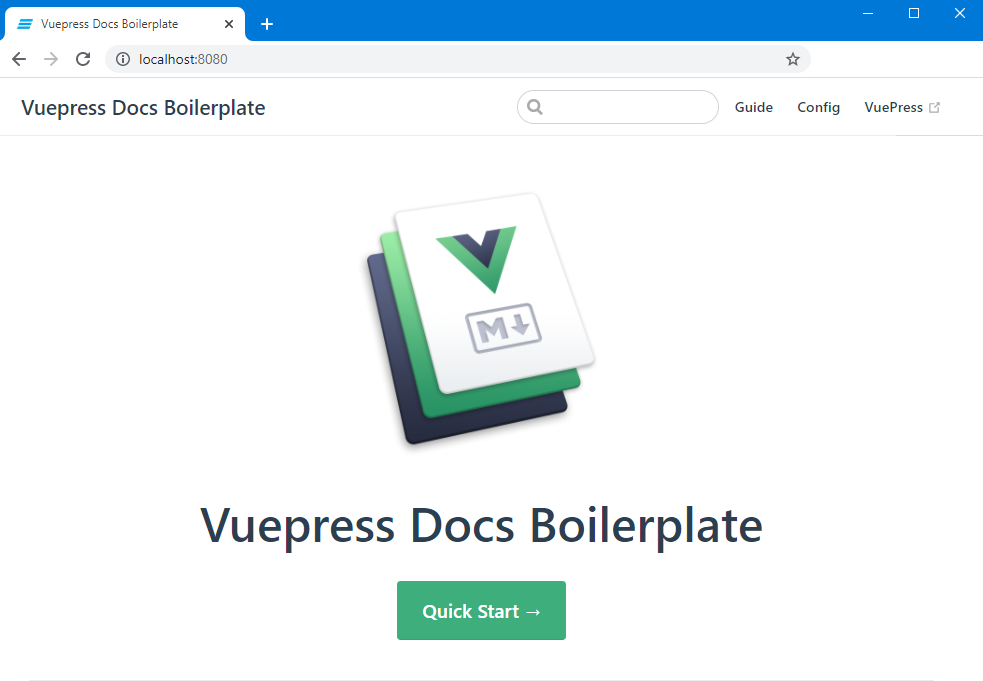

Отредактировать страницы можно в следующих файлах:
- `"./src/index.md"` - главная страница
- `"./src/config/README.md"` - страница "Config"
- `"./src/guide/README.md"` - страница "Guide"

Установка NPX-пакета с готовой архитектурой позволяет быстро развернуть приложение с базовым набором страниц. Но вместо того чтобы проводить рефакторинг и оптимизировать полученный шаблон под себя, предлагаю самостоятельно развернуть проект и последовательно разобраться с функционалом VuePress.

---

## <a name="develop"></a> Разработка приложения на VuePress с нуля

Создадим новый проект и откроем его в терминале.

### <a name="develop-init"></a> 1. Инициализация проекта
```bash
npm init     # инициализация с указанием настроек проекта
npm init -y  # инициализация с дефолтными настройками
```

После инициализации проекта создается файл `"package.json"`. При установке с дефолтными настройками (`"npm init -y"`), файл выглядит следующим образом:

```bash
{
    "name": "vue-press",
    "version": "1.0.0",
    "description": "",
    "main": "index.js",
    "scripts": {
        "test": "echo \"Error: no test specified\" && exit 1"
    },
    "keywords": [],
    "author": "",
    "license": "ISC"
}
```

Где `"vue-press"` в поле `"name"` - это название директории проекта.

### <a name="develop-install"></a> 2. Установка VuePress

Выполним команду в терминале:
```bash
npm i --save-dev vuepress
```

В проекте появится директория `"node_modules"` с пакетами, необходимыми для работы VuePress.
В файл `"package.json"` добавится секция `"devDependencies"` с установленным пакетом.

```bash
"devDependencies": {
    "vuepress": "^1.8.2"
}
```

В раздел `"devDependencies"` помещаются пакеты, необходимые только на этапе разработки.

### <a name="develop-scripts"></a> 3. Добавление скриптов

Скорректируем секцию `"scripts"` в файле `"package.json"`. Скрипт `"test"` не пригодится - поэтому его можно удалить. Следуя [документации VuePress](https://vuepress.vuejs.org/guide/getting-started.html#manual-installation), добавим 2 скрипта. Секция `"scripts"` будет выглядеть следующим образом:

```bash
"scripts": {
    "start": "vuepress dev src",
    "build": "vuepress build src"
}
```

- Скрипт `"start"` запустит приложение на локальном сервере.
- Скрипт `"build"` соберет приложение для production.

Рассмотрим параметры для скриптов:
- `"vuepress dev src"` для скрипта `"start"`, запустит `"vuepress"` в режиме разработки и будет искать нужные файлы в директории `"src"`. 
- `"vuepress build src"` для скрипта `"build"`, запустит `"vuepress"` в production-режиме, будет искать нужные файлы в директории `"src"` и  соберет проект для production.

Для запуска скриптов также используем:
```bash
npm run start
npm run build
```

На данном этапе не заложена структура приложения, поэтому скрипты выполняться не будут. 

### <a name="develop-structure"></a> 4. Разработка архитектуры приложения

Разработаем архитектуру приложения, как показано на изображении:

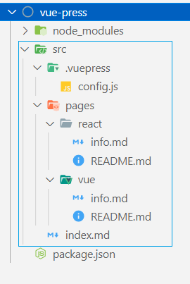

Основные директории и файлы:
- `"./src/index.md"` - точка входа в приложение
- `"./src/.vuepress/"` - директория с настройками VuePress
- `"./src/pages"` - директория со страницами

Разберем алгоритм работы приложения и его архитектуру:
1. При выполнении скрипта `"start": "vuepress dev src"`, VuePress запускается  в режиме разработки с указанием рабочей директории `"src"`.
2. В `"src"` находится точка входа в приложение: файл `"index.md"`, содержимое которого рендерится на главную страницу.
3. VuePress ищет в `"src"` директорию `".vuepress"` для чтения настроек (директория должна называться именно так).
4. В файле `"./src/.vuepress/config.js"` находятся все настройки по работе VuePress. Происходит сопоставление страниц приложения и роутов: здесь мы указываем, что именно в `"pages"` хранятся все страницы.
5. Директория `"pages"` содержит все страницы приложения. 
В нашем случае, их всего две: с темами по React.js (директория `"react"`) и по Vue.js (директория `"vue"`). Страницы приложения были придуманы абстрактно.
6. Для каждой страницы (директория `"pages"`) должен быть файл `"README.md"`. Он выполняет функцию, аналогичную `"./src/index.md"`. Кроме этого, добавлен файлы `"info.md"` для каждой темы - это произвольные описательные страницы.

### <a name="develop-markdown"></a> 5. Markdown-файлы

Из файлов с расширением `".md"`, код компилируется в HTML-страницы.

Код в файлах `".md"` можно писать:
- На языке Markdown
- Используя YAML Front Matter
- На чистом HTML

В статье мы будем использовать Markdown, позволяющий максимально быстро разметить контент.

Откроем последовательно файлы `".md"` и добавим произвольный контент. Символ `"#"` в Markdown добавляет заголовок первого уровня.

-  ./src/index.md
```markdown
# Главная страница приложения
```

-  ./src/pages/react/README.md
```markdown
# Главная страница справочника по React.js
```

-  ./src/pages/react/info.md
```markdown
# Описание фреймворка React.js
```

-  ./src/pages/vue/README.md
```markdown
# Главная страница справочника по Vue.js
```

-  ./src/pages/vue/info.md
```markdown
# Описание фреймворка Vue.js
```

### <a name="develop-config"></a> 6. Файл config.js

Осталось указать, что страницы необходимо брать из директории `"pages"`.

Базовая структура конфигурации `"./src/.vuepress/config.js"`:
```js
module.exports = {
    themeConfig: {
        // Ссылки на разделы
        nav: [
            {
                text: 'Название раздела',
                link: 'Путь к разделу'
            },
        ],
        // Ссылки внутри раздела
        sidebar: {
            'Путь к разделу': [
                {
                    title: 'Название подраздела',  // 
                    children: [
                        ['Путь к теме', 'Название темы'],        
                    ]
                }
            ]
        }
    },
}
```

В качестве импорта и экспорта используется CommonJS (модульная система Node.js), поэтому указываем `"module.exports"`.

Проведём оптимизацию и вынесем в константы роуты (в нашем случае, это `"nav"` и `"sidebar"`).
```js
// Константы с роутами к страницам
const PAGE_VUE = '/pages/vue/';
const PAGE_REACT = '/pages/react/';

// Ссылки на разделы
const NAV = [
    {
        text: 'Vue.js',
        link: PAGE_VUE
    },
    {
        text: 'React.js',
        link: PAGE_REACT
    },
];

// Ссылки внутри раздела
const SIDEBAR = {
    [PAGE_VUE]: [
        {
            title: 'Информация',
            children: [
                ['info', 'Vue.js'],
            ]
        }
    ],
    [PAGE_REACT]: [
        {
            title: 'Информация',
            children: [
                ['info', 'React.js'],
            ]
        }
    ]
};

module.exports = {
    themeConfig: {
        nav: NAV,
        sidebar: SIDEBAR
    },
}
```

### <a name="develop-run"></a> 7. Запуск приложения
Запустим терминал из рабочей директории и выполним скрипт:
```bash
npm run start
```

Переходим по адресу: [http://localhost:8080/](http://localhost:8080/).

На главной странице видим текст из `"./src/index.md"`. В меню отображаются две ссылки: "Vue.js" и "React.js".

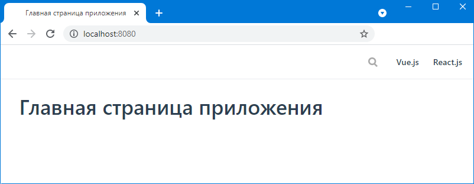

Перейдем на вкладку "Vue.js". URL изменился на [http://localhost:8080/pages/vue/](http://localhost:8080/pages/vue/). На странице видим текст из `"./src/pages/vue/README.md"`.

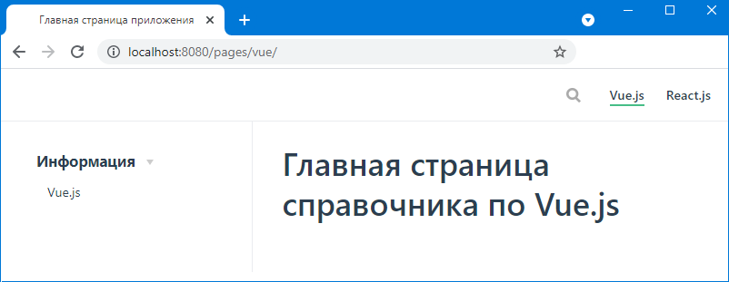

В сайдбаре в разделе "Информация" выберем "Vue.js". URL изменился на [http://localhost:8080/pages/vue/info.html](http://localhost:8080/pages/vue/info.html). На странице видим текст из `"./src/pages/vue/info.md"`.

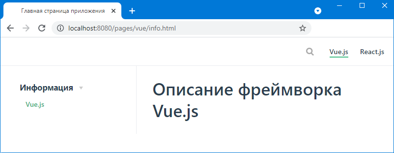

Поздравляю! Мы разработали минимальное приложение на VuePress. Теперь посмотрим на дополнительный функционал.

### <a name="develop-img"></a> 8. Добавление изображений

Добавим новую директорию `"img"` в `"./src/pages/vue"` (по аналогии можно добавить и для `"./src/pages/react"`). Поместим в `"img"` изображение `"vue-logo.jpg"`.

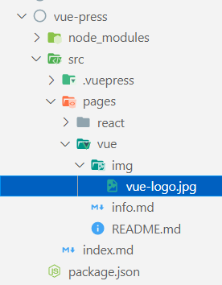

Теперь из файла `"./src/pages/vue/info.md"` можно получить доступ к изображению.

```markdown
<!-- Markdown-формат -->

```

```html
<!-- HTML-формат -->

```

При использовании HTML-формата возможно указать ширину изображения, что во многих ситуациях, будет удобнее разметки Markdown.

Для изображений можно задавать не только относительные путь, но и абсолютные. Некоторые изображения должны быть доступны не только в рамках одной страницы, а во всём приложении. Такие изображения необходимо добавлять в `"./src/.vuepress/public"`. Обратиться к ним можно напрямую, указывая `"/"` или через Vue-переменную `"$withBase"`.

```html
<!-- Использование пути "/" -->


<!-- Использование Vue-переменной -->

```

### <a name="develop-favicon"></a> 9. Добавление favicon и meta-данных

Favicon разместим в директории, содержащей общие ресурсы: `"src/.vuepress/public/favicon.svg"`

После этого в конфиге `"src/.vuepress/config.js"` укажем favicon в разделе `"head"`. Кроме favicon, в данном разделе можно добавить meta-данные для нашего приложения:
```js
module.exports = {
    themeConfig: {
        //
    },
    head: [
        ['link', { rel: 'icon', href: '/favicon.svg' }],
        ['meta', { name: 'theme-color', content: '#3eaf7c' }],
        ['meta', { name: 'apple-mobile-web-app-capable', content: 'yes' }],
        ['meta', { name: 'apple-mobile-web-app-status-bar-style', content: 'black' }]
    ]
}
```

### <a name="develop-color-theme"></a> 10. Изменение цветовой схемы

По умолчанию, для приложения VuePress задана стандартная цветовая схема, но ее можно изменить. Для этого создадим директорию `"styles"` в `"./src/.vuepress/"`. В `"styles"` добавим два файла на препроцессоре `"Stylus"` (это дефолтный препроцессор в VuePress):
- `"index.styl"` - содержит общие стили для приложения (н-р: можно добавить стили ко всем изображениям).
- `"palette.styl"` - содержит переменные цветовой схемы, которые можно переопределить.

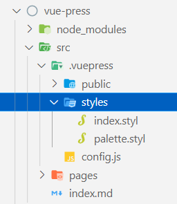

Для файла `"palette.styl"` доступны следующие переменные:
```Stylus
$accentColor = #3eaf7c
$textColor = #2c3e50
$borderColor = #eaecef
$codeBgColor = #282c34
```

Корректируя значения, можно изменить цветовую схему приложения.

### <a name="develop-search"></a> 11. Подключение поиска
Поиск осуществляется с помощью технологии [Algolia](https://www.algolia.com/): индексируются все заголовки первого, второго и третьего уровней (h1-h3), и в дальнейшем, поиск происходит именно по ним.

Для подключения поиска, в конфиге `"src/.vuepress/config.js"` достаточно указать `"search: true"`:
```js
module.exports = {
    themeConfig: {
        search: true,
    },
}
```

Проверим работу поиска. На данный момент, у каждой страницы присутствует заголовок первого уровня. Вводим в поиск часть слова, и по итогу получим ссылки на страницы с совпадением.

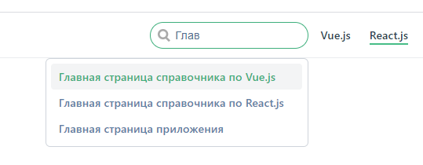

Добавим еще несколько заголовков второго, третьего и четвертого уровней в любой из Markdown-файлов. После этого можно будет заметить, что индексируются только заголовки первого, второго и третьего уровня. Поиск по заголовку четвертого уровня не осуществляется.

### <a name="develop-vue"></a> 12. Использование Vue-компонентов

VuePress использует фреймворк Vue.js - следовательно, можно добавлять кастомные Vue-компоненты в наши Markdown-файлы.

Создадим директорию `"components"` в `"./src/.vuepress/"`, в которой будут находиться кастомные vue-компоненты (название директории должно быть именно таким):

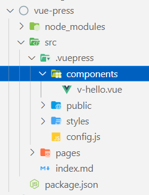

Создадим простой vue-комопнент в директории `"components"`. Назовём его `"v-hello.vue"` - он будет выводить приветствие для пользователя с указанным именем.

```html
<template>
    <div class="wrapper">
        Hello, {{name}}!
    </div>
</template>

<script>
export default {
	props: ['name']
}
</script>

<style scoped>
.wrapper {
    padding: 10px;
    margin: 10px 0;
    font-weight: 600;
    background-color: #44e4d6;
}
</style>
```

Вызывать компонент можно из любого Markdown-файла страниц. Пример вызова компонента:

```html
<v-hello name="Tony" />
```

Результат вызова:


### <a name="develop-build"></a> 13. Сборка проекта

Для сборки проекта используется скрипт:
```bash
npm run build
```

После успешной сборки, собранный проект будет находиться в `"./src/.vuepress/dist"`. Посмотрим на структуру директории `"dist"`:

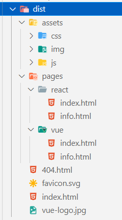

Структура директории:
- Директория `"assets"` - ресурсы для страниц
- Директория `"pages"` - сами страницы: "react" и "vue"
- Страница 404 сгенерировалась автоматически
- Корневые файлы `"favicon.svg"` и `"favicon.svg"` - были взяты из `"./src/.vuepress/public"`.
- Файл `"index.html"` - стартовая страница

Проект представляет собой статичные файлы, готовые к загрузке на сервер.

Обратим внимание на задание путей в файлах `".html"`. Для примера, возьмем файл `"./src/.vuepress/public/index.html"`. В этом файле я оставил только некоторые пути для демонстрации:

```html
<!DOCTYPE html>
<html>
    <head>
        <link rel="icon" href="/favicon.svg">
        <link rel="preload" href="/assets/css/0.styles.96af6c87.css">
        ...
    </head>
    <body>
        ...
        <script src="/assets/js/app.b24ed5d1.js" defer></script>
        ...
    </body>
</html>
```

Пути начинаются с `"/"` - это значит, что файлы будут искаться в корневой директории. К примеру, для сайта `"https://mysite.ru"`, `"favicon.svg"` должен находиться в корне проекта.

Но что если, проект располагается по адресу `"https://mysite.ru/vue-press"` и файл `"favicon.svg"` находится в директории `"vue-press-sample"`? В таком случае, путь к `"favicon.svg"` будет некорректен:
```html
<!-- Некорректно -->
<link rel="icon" href="/favicon.svg">

<!-- Корректно -->
<link rel="icon" href="/vue-press-sample/favicon.svg">
```

Для задания корневого URL сборки необходимо изменить конфиг VuePress.

### <a name="develop-base-url"></a> 14. Задание корневого URL

Если приложение будет находиться в директории, отличной от корневой, то скорректируем раздел `"base"` в файле `"./src/.vuepress/config.js"`:
```js
module.exports = {
    themeConfig: {},
    base: '/vue-press-sample/',
}
```

В разделе `"base"` я указал название своего будущего GitHub-репозитория, т.к. при деплое на GitHub Pages, в качестве адреса будет браться его название.

Запустим сборку проекта `"npm run build"` и посмотрим на файл `"./src/.vuepress/public/index.html"`. Опять же, для демонстрации, я привёл только часть файла:
```html
<!DOCTYPE html>
<html>
    <head>
        <link rel="icon" href="/vue-press-sample/favicon.svg">
        <link rel="preload" href="/vue-press-sample/assets/css/0.styles.96af6c87.css">
        ...
    </head>
    <body>
        ...
        <script src="/vue-press-sample/assets/js/app.b24ed5d1.js" defer></script>
        ...
    </body>
</html>
```

Видно, что в пути для каждого файла добавилось `"/vue-press-sample/"` - это то, что мы указывали в файле конфига в разделе `"base"`.

Таким образом, мы получили сборку нашего приложения, готовую для загрузки на GitHub и GitHub Pages.

### <a name="develop-github"></a> 15. Деплой на GitHub

Для начала добавим файл `".gitignore"` в корень проекта. Судя из названия, мы можем прописать в нём файлы или директории, которые не следует загружать на GitHub.

На GitHub загружаем только исходные файлы. Всё что можно собрать или установить, загружать не нужно.

Что вынесем в игнор:
- `"node_modules"` - установленные npm-пакеты. При клонировании репозитория, выполняем команду `"npm i"` и из файла `"package.json"` происходит установка всех пакетов.
- `"./src/.vuepress/dist"` - сборка нашего приложения. При клонировании репозитория, выполняем команду `"npm run build"` и сборка готова.

Файл `".gitignore"` будет выглядеть следующим образом:
```
node_modules
src/.vuepress/dist
```

Загрузим проект на GitHub. Для этого можно воспользоваться любимыми инструментами: GitHub Desktop, командной строкой или другими приложениями.

По итогу, получим GitHub-репозиторий с проектом:

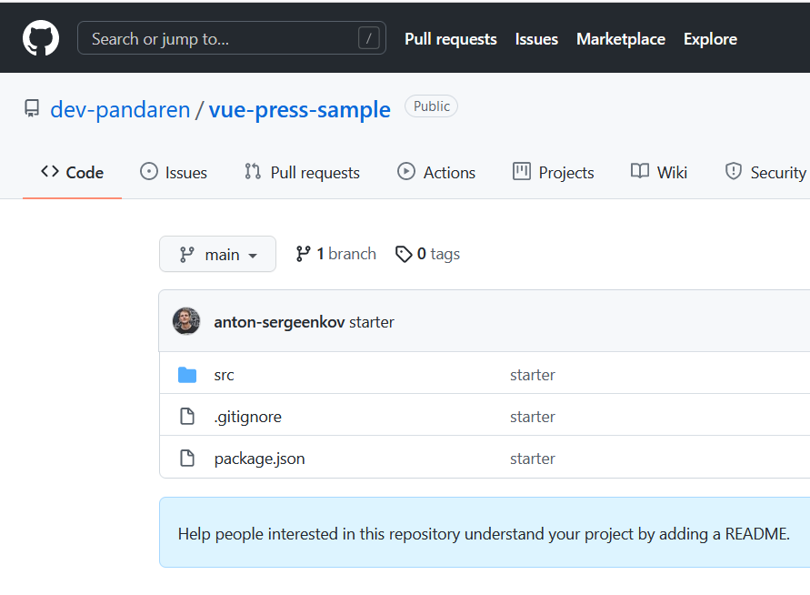

Мой проект можно посмотреть по [ссылке](https://github.com/dev-pandaren/vue-press-sample).

Переходим к деплою на GitHub Pages.

### <a name="develop-github-pages"></a> 16. Деплой на GitHub Pages

Для GitHub Pages по умолчанию используется ветка `"gh-pages"` репозитория, но при желании, в настройках в секции `"Pages"` можно указать и другую:

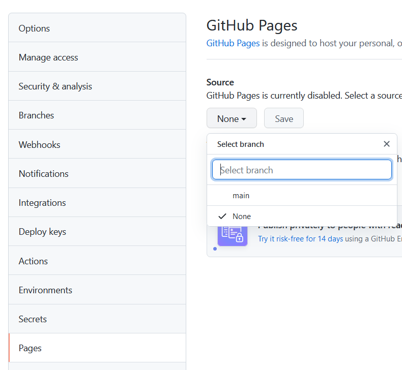

Для деплоя, можно вручную вручную создать ветку `"gh-pages"` и загрузить сборку приложения - директорию `"src\.vuepress\dist"`, которая создаётся при выполнении команды `"npm run build"`. Но это не столь удобно.

Для автоматизации установим npm-пакет `"gh-pages"`. При этом, будет достаточно только запустить npm-скрипт и пакет самостоятельно создаст ветку `"gh-pages"` (если ее еще не было) и загрузит фалы сборки.

```bash
npm i gh-pages --save-dev
```

После установки, в файле `"package.json"` добавим 2 скрипта:
```json
"scripts": {
    "build-gh-pages": "gh-pages -d src/.vuepress/dist",
    "deploy": "npm run build && npm run build-gh-pages"
},
```

- Скрипт `"build-gh-pages"` возьмёт файлы сборки из `"src/.vuepress/dist"` и запустит пакет `"gh-pages"`
- Скрипт `"deploy"` - группирует существующие скрипты и выполняет их в определенном порядке: делаем сборку приложения, потом запускам работу пакета `"gh-pages"`

Также, в секцию `"homepage"` пропишем адрес нашего репозитория (для вас адрес будет другим):
```json
{
    "homepage": "https://github.com/dev-pandaren/vue-press-sample",
}
```

- `dev-pandaren` - название аккаунта
- `vue-press-sample` - название репозитория


Итоговый вид файла `"package.json"` будет выглядеть следующим образом:
```json
{
    "name": "vue-press",
    "version": "1.0.0",
    "homepage": "https://github.com/dev-pandaren/vue-press-sample",
    "main": "index.js",
    "scripts": {
        "start": "vuepress dev src",
        "deploy": "npm run build && npm run build-gh-pages",
        "build": "vuepress build src",
        "build-gh-pages": "gh-pages -d src/.vuepress/dist"
    },
    "devDependencies": {
        "gh-pages": "^3.1.0",
        "vuepress": "^1.5.3"
    }
}
```

Запустим скрипт `"deploy"`: произойдет сборка приложения и деплой на GitHub Pages. Если вы не авторизованы на GitHub, то появится окно, предлагающее это сделать.

Сообщения в консоли будут выглядеть подобным образом:

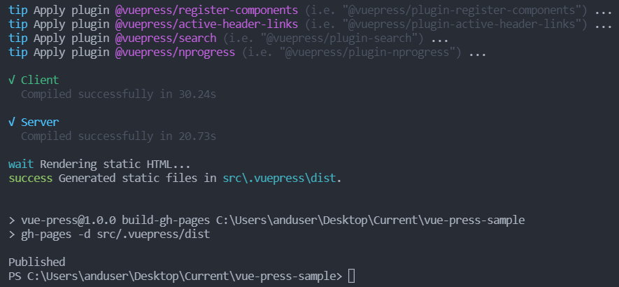

Перейдем на GitHub и увидим еще одну ветку `"gh-pages"`, в которой будет сборка нашего приложения:

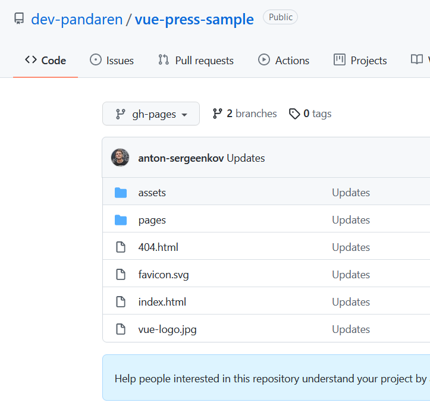

Вот и всё! После создания ветки `"gh-pages"`, GitHub возьмёт файлы сборки и создаст GitHub Pages - для этого потребуется некоторое время (до 24 часов).

Если мы перейдем обратно в настройки репозитория и выберем секцию `"Pages"`, то увидим ссылку на страницу GitHub Pages. При этом, в разделе "Source", необходимо выбрать ветку `"gh-pages"`, если она не была выбрана.

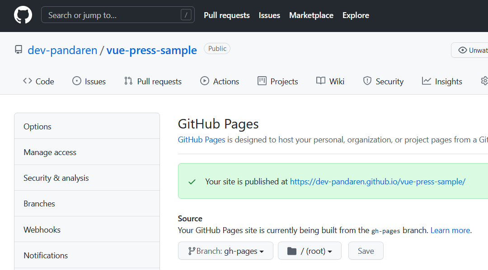

В моём случае это: https://dev-pandaren.github.io/vue-press-sample/

Разберем адрес по частям:
- `dev-pandaren` - название аккаунта
- `.github.io` - домен для GitHub Pages
- `vue-press-sample` - название репозитория

Переходим по указанному адресу GitHub Pages и видим наше приложение:

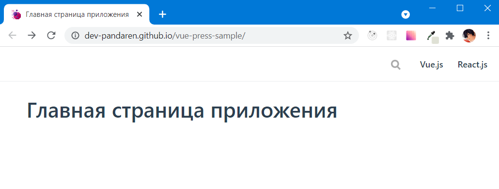

На этом мы завершили разработку и деплой простого приложения на VuePress. Ниже привожу основные ссылки.

---

## <a name="links"></a> Ссылки

### Ссылки на документацию
- https://vuepress.vuejs.org/
- https://vuejs.org/
- https://www.algolia.com/

### Ссылки на готовое приложение
- https://github.com/dev-pandaren/vue-press-sample
- https://dev-pandaren.github.io/vue-press-sample/
